# DUDE User Guide

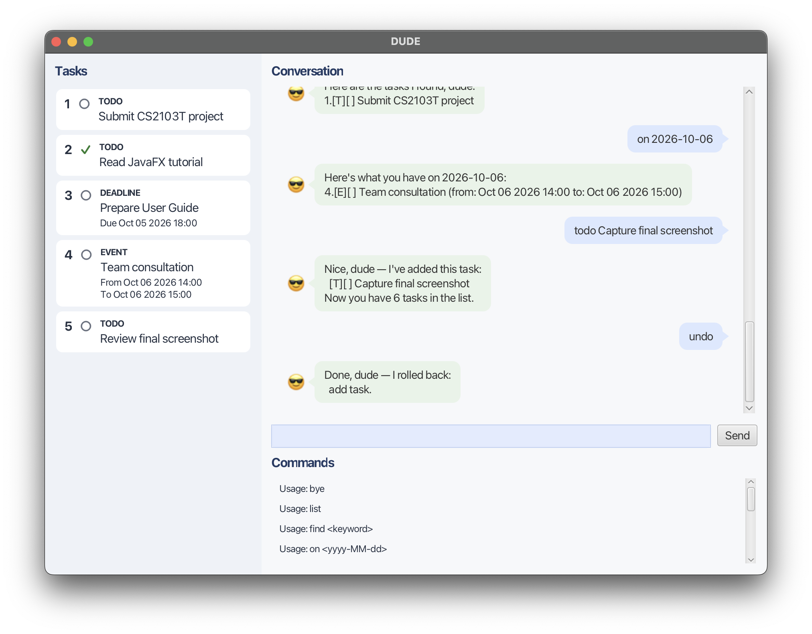

DUDE is a desktop task manager for keeping track of todos, deadlines, and
events. Enter commands in the conversation box, or select a command from the
scrollable command palette.

## Contents

- [Getting started](#getting-started)
- [Building from source](#building-from-source)
- [Using the GUI](#using-the-gui)
- [Commands](#commands)
  - [Show all tasks](#show-all-tasks)
  - [Add a todo](#add-a-todo)
  - [Add a deadline](#add-a-deadline)
  - [Add an event](#add-an-event)
  - [Find tasks](#find-tasks)
  - [Find tasks on a date](#find-tasks-on-a-date)
  - [Complete or uncomplete a task](#complete-or-uncomplete-a-task)
  - [Delete a task](#delete-a-task)
  - [Undo a change](#undo-a-change)
  - [Exit DUDE](#exit-dude)
- [Duplicate tasks](#duplicate-tasks)
- [Error messages](#error-messages)
- [Data and troubleshooting](#data-and-troubleshooting)

## Getting started

DUDE requires Java 25. Download the latest [`dude.jar`](https://github.com/ViincentLim/ip/releases/latest)
from the [GitHub Releases page](https://github.com/ViincentLim/ip/releases), then
place it in an empty folder.

Open a terminal in that folder and run:

```bash
java -jar dude.jar
```

DUDE stores tasks in a `data/dude.jsonl` file relative to the folder from which
the JAR is run. Start DUDE from a folder where it can create and update this
file.

## Building from source

The source code is available in the [DUDE GitHub repository](https://github.com/ViincentLim/ip).
This section is intended for contributors and developers who want to build the
application themselves. Clone the repository and run from its root:

```bash
git clone https://github.com/ViincentLim/ip.git
cd ip
./gradlew run
```

To build and run the packaged application:

```bash
./gradlew clean shadowJar
java -jar build/libs/dude.jar
```

## Using the GUI

- The **Tasks** sidebar shows numbered tasks, completion status, task type,
  descriptions, and dates.
- The **Conversation** area shows your commands on the right and DUDE's
  responses on the left.
- Click **Send** or press Enter to submit a command.
- The command palette below the input filters suggestions as you type.
- Press Up or Down to move to the command palette, then press Enter or Tab to
  complete the highlighted command. You can also click a suggestion.
- Use the native window close control or the `bye` command to exit.

The command palette is the command reference in the GUI; DUDE does not provide
parameter ghost text or autocomplete suggestions beyond this list.

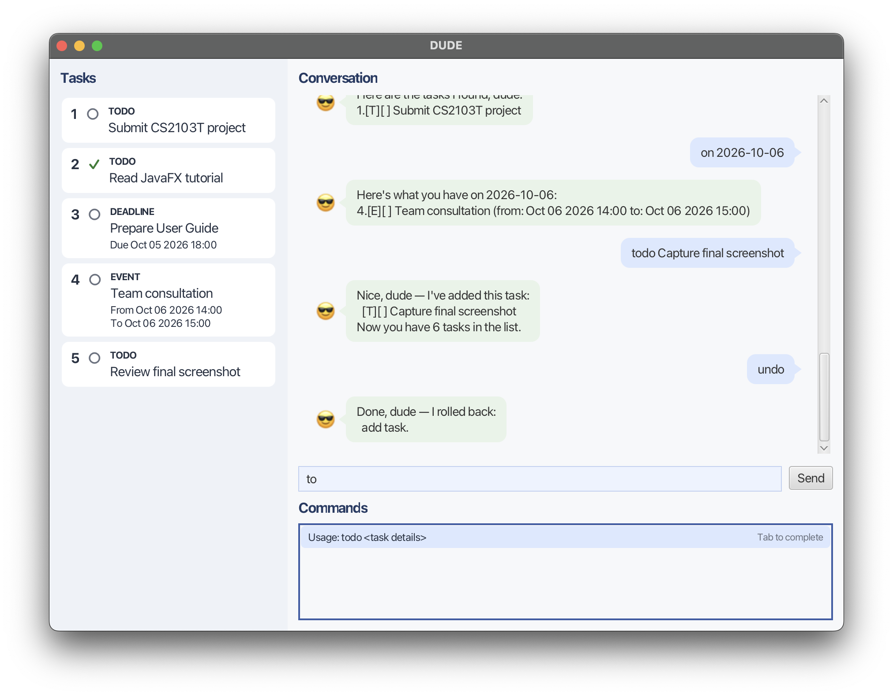

## Commands

### Show all tasks

```text
list
```

Displays every task in its current order.

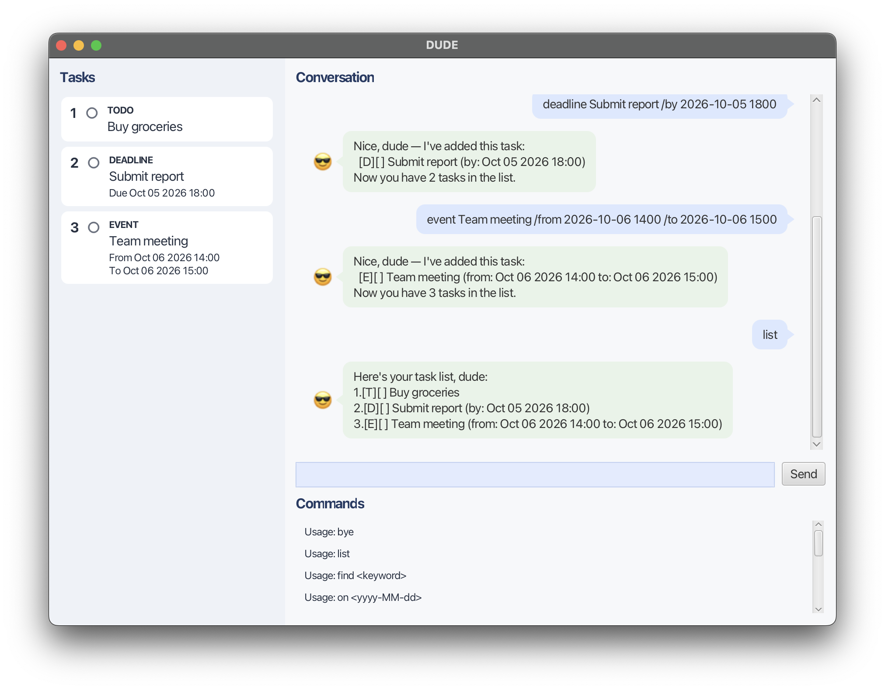

### Add a todo

```text
todo <task details>
```

Example:

```text
todo submit CS2103T project
```

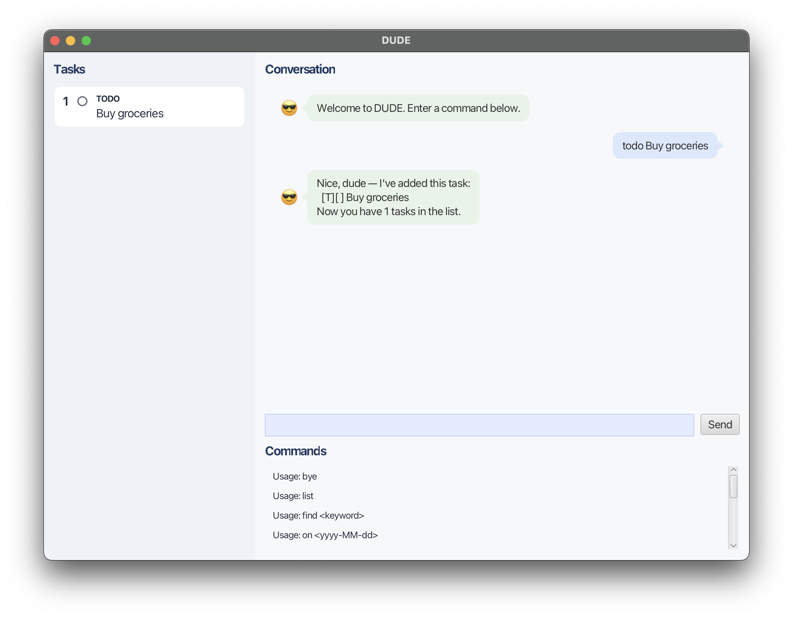

### Add a deadline

```text
deadline <description> /by <yyyy-MM-dd [HHmm]>
```

Examples:

```text
deadline prepare User Guide /by 2026-10-05
deadline submit report /by 2026-10-05 1800
```

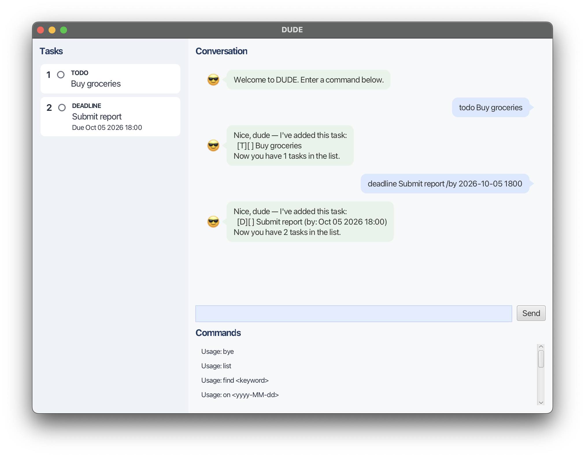

### Add an event

```text
event <description> /from <yyyy-MM-dd [HHmm]> /to <yyyy-MM-dd [HHmm]>
```

Example:

```text
event team consultation /from 2026-10-06 1400 /to 2026-10-06 1500
```

The end of an event must be after its start.

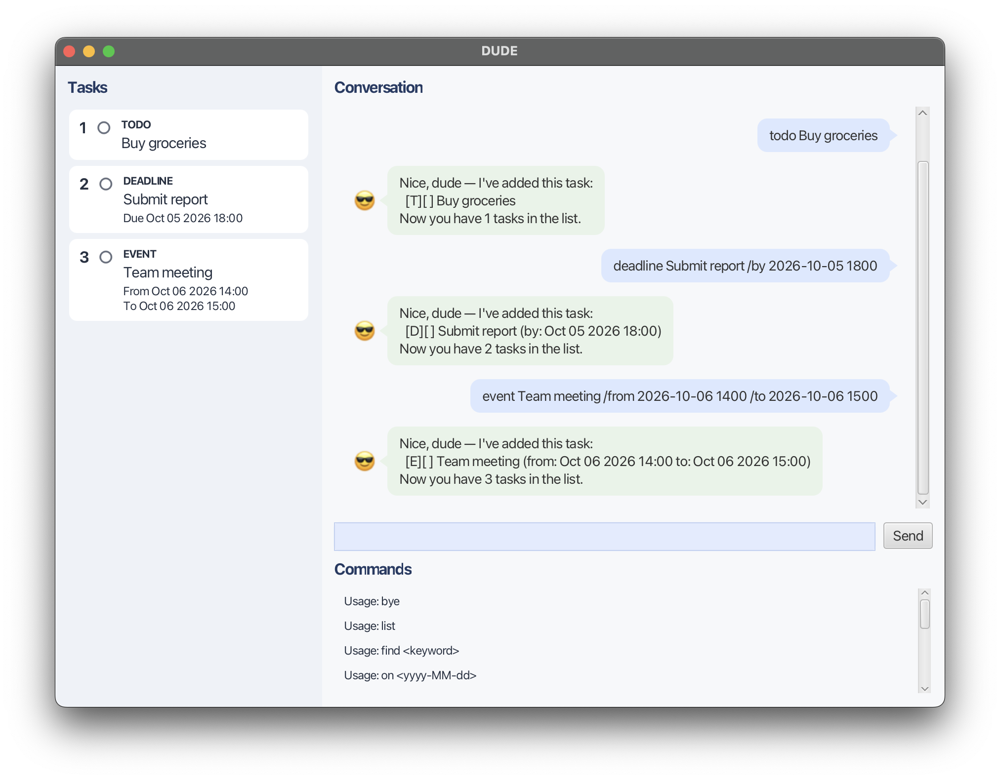

### Find tasks

```text
find <keyword>
```

Finds tasks whose descriptions contain the keyword, without considering letter
case.

Example:

```text
find project
```

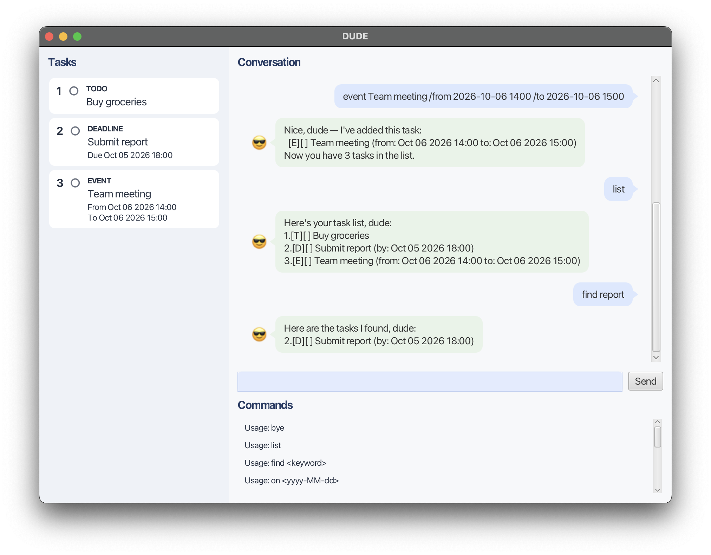

### Find tasks on a date

```text
on <yyyy-MM-dd>
```

Example:

```text
on 2026-10-06
```

This includes deadlines and events occurring on the specified date.

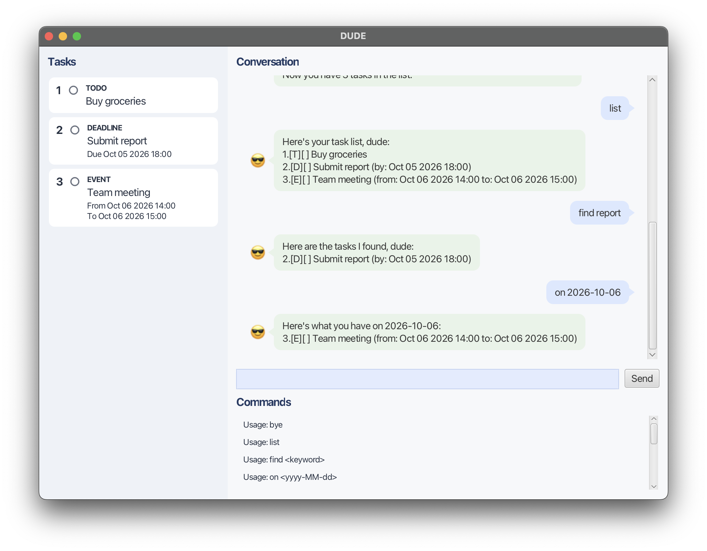

### Complete or uncomplete a task

```text
mark <task number>
unmark <task number>
```

Examples:

```text
mark 2
unmark 2
```

Task numbers refer to the numbered order currently shown in the task list.

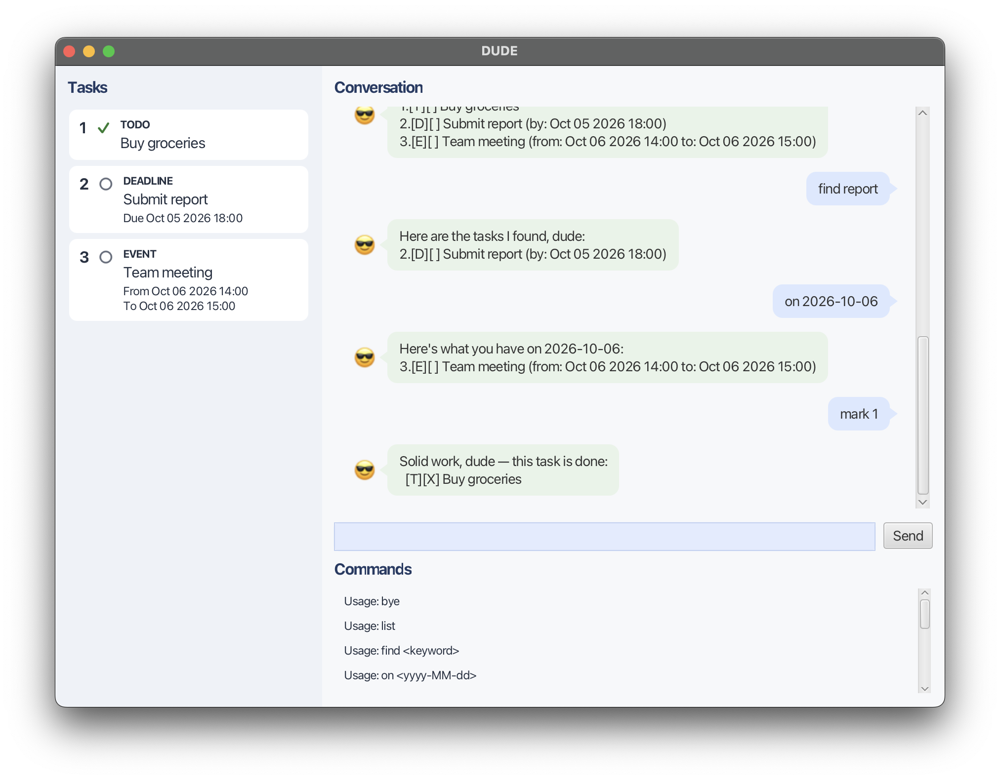

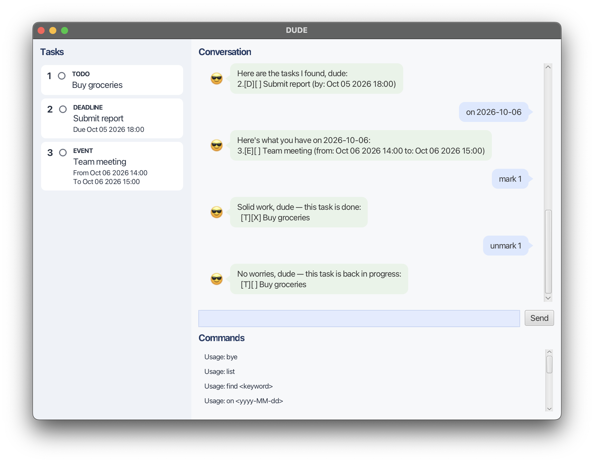

### Delete a task

```text
delete <task number>
```

Example:

```text
delete 4
```

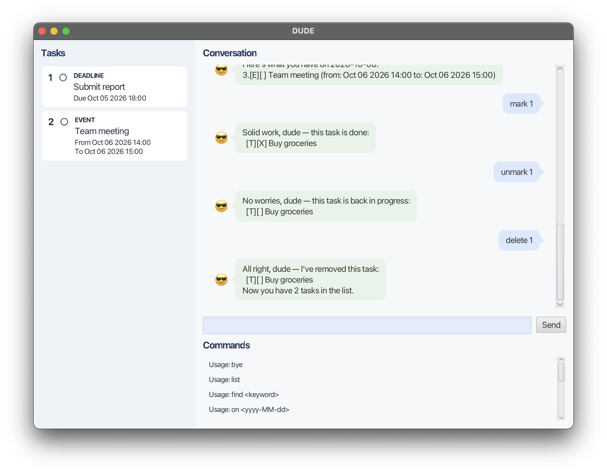

### Undo a change

```text
undo
```

Reverses the most recent command that changed the task list, such as adding,
deleting, marking, or unmarking a task. Read-only commands such as `list`,
`find`, and `on` do not create undo history.

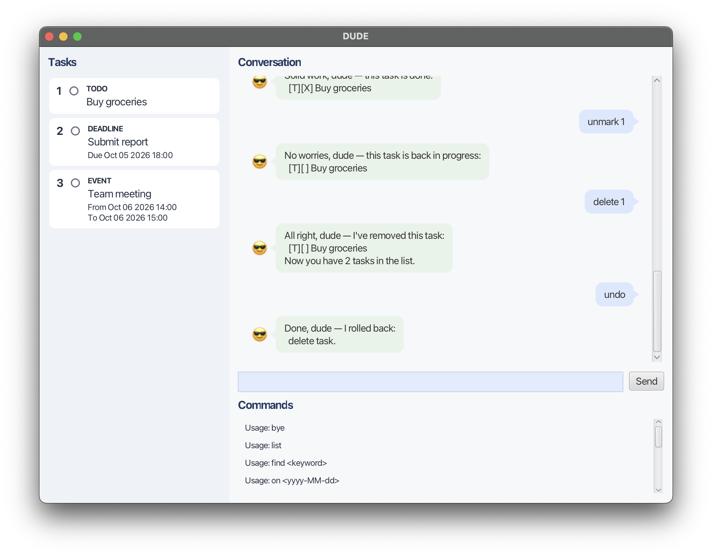

### Exit DUDE

```text
bye
```

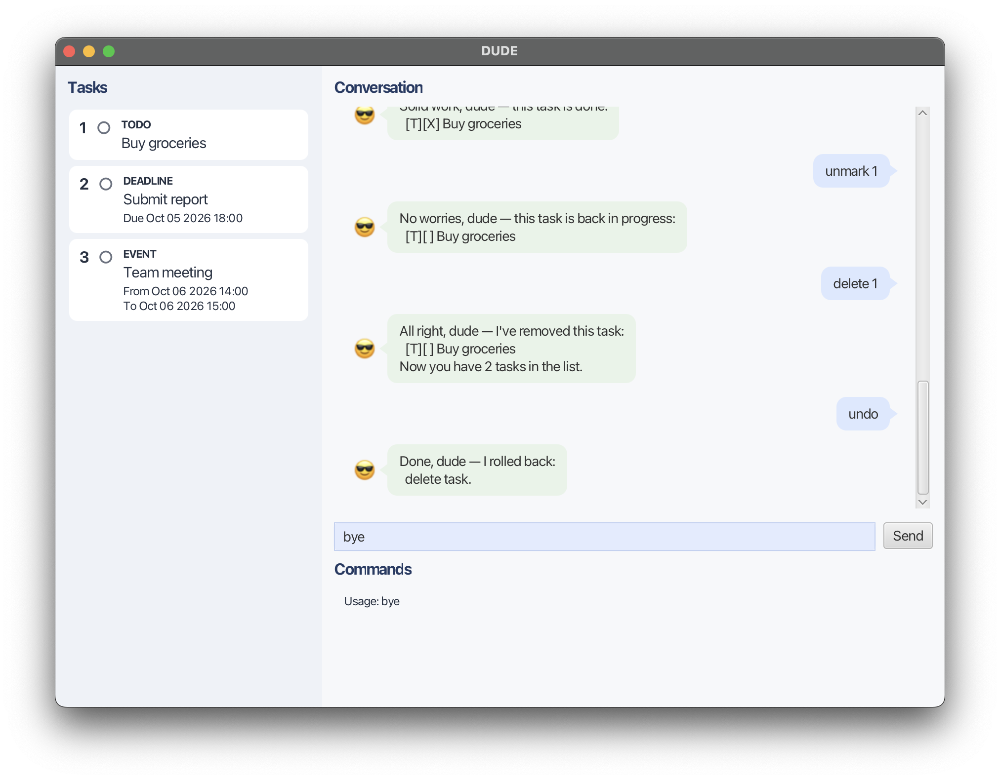

## Duplicate tasks

If a new task has the same description as an existing task, DUDE shows a
dialog with three choices:

- **Edit** replaces the matching task with the new task details.
- **Add** keeps both tasks.
- **Cancel** leaves the task list unchanged.

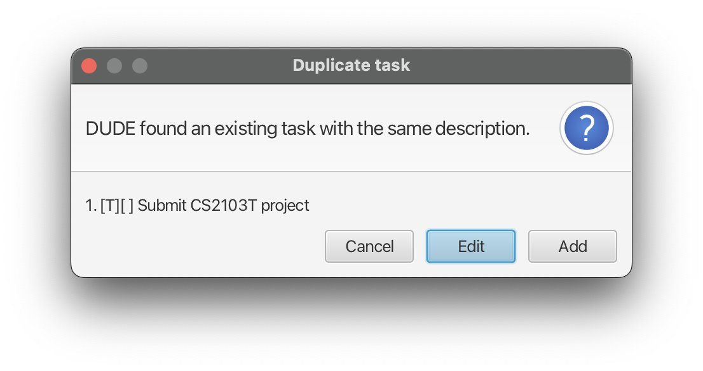

## Error messages

DUDE reports invalid commands and malformed parameters in a separate error
bubble. The message explains what went wrong and places the corrected usage
after `Try:` on its own line.

For example, entering `todo` without task details produces guidance to use:

```text
Try: todo <task details>
```

Dates must use `yyyy-MM-dd`, with an optional time in `HHmm` format for
deadlines and events. Task numbers must refer to existing tasks.

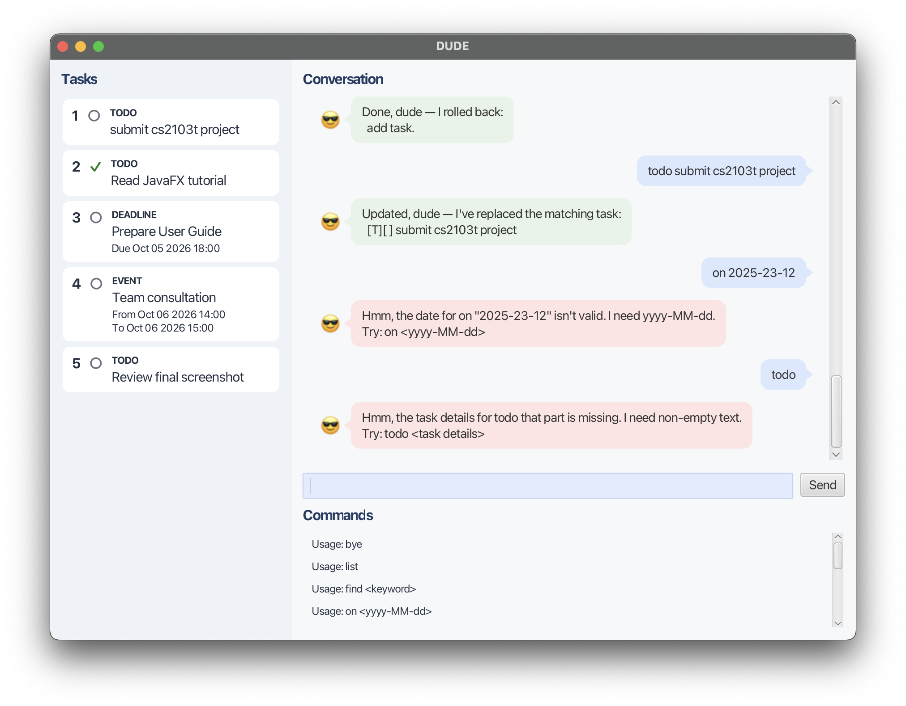

## Data and troubleshooting

DUDE creates its `data` directory and `dude.jsonl` file in the current working
directory. Start DUDE from a directory where it can create and update these
files. If the data file contains an invalid record, DUDE keeps the rest of the
task list available and reports the affected record as corrupted.
